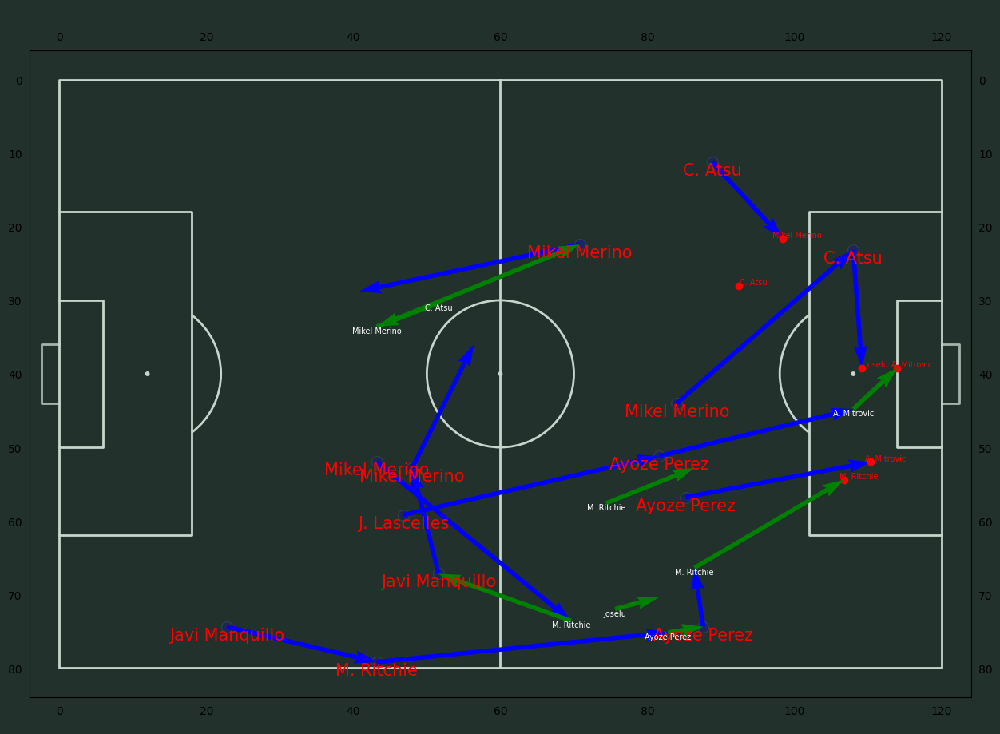

# Data-analysis-in-Football

This project was thought to be a tool for football coaches. 

### Passes 15 seconds before any goal or direct shot.

### Pass_nodes between sustitutions.
The structure after each sustitution can be appreciated. The larger the node, the greater the number of passes made by the player and the more intense the yellow arrow, the greater the number of passes there were between these two nodes.

### Threat map.

It assigns a value for each zone of the field. When a goal is conceded the algorithm assigns a threat value to each zone as function of the number of events or actions that took place between the event in the zone and the goal.

### Match Momentum.

It indicates which team is being more threatening.

